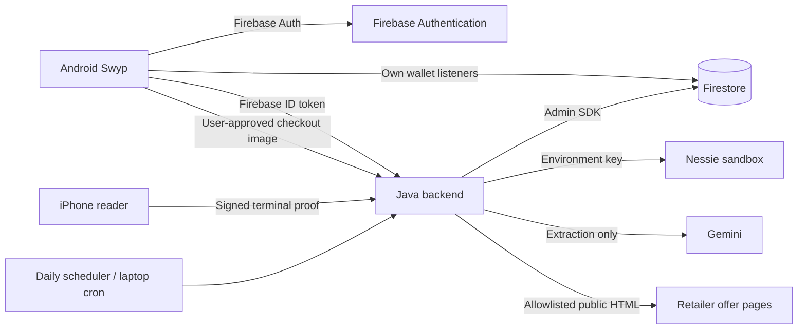

# Swyp implementation

## Data and service boundaries



All durable wallet data is in Firestore. Firebase Auth manages Android user credentials. Device-only state includes non-exportable Android Keystore private keys, transient screenshots, and geofence registration/cooldown preferences. API secrets exist only in backend environment variables. The iPhone reader does not log in; Android uses the Firebase Auth SDK's session storage. Firestore's Android SDK uses its normal local cache.

## Collections

| Path | Contents and write authority |
| --- | --- |
| `config/app` | Admin-only `auto-generate-transactions` Boolean |
| `users/{uid}` | Setup state, Nessie customer/merchant IDs, simulated persona, utilization limit, activated offer IDs; backend writes |
| `users/{uid}/cards/{id}` | Product, display suffix, demo limit/debt in integer cents, Nessie account ID, registered device public key, confirmed checkout window; backend writes |
| `users/{uid}/transactions/{id}` | Purchases, category, merchant, ISO date, integer cents, Nessie purchase ID; backend writes |
| `users/{uid}/bills/{id}` | Recurring bill associations and Nessie bill IDs |
| `users/{uid}/statements/{id}` | Synthetic historical statement utilization and simulated score indicator |
| `users/{uid}/repayments/{id}` | Synthetic monthly debt repayments and Nessie funding deposit IDs |
| `users/{uid}/paymentRequests/{nonce}` | Backend-created signed terminal proof and settlement status |
| `credentials/{cardId}` | Server-only lookup from a prepared card ID to its owning user; refreshed when Android prepares the card |
| `dealSources/{id}` | Administrator-enabled public URLs, last success/error |
| `dealCandidates/{id}` | Gemini-extracted offers requiring eligibility review; backend writes |
| `deals/{id}` | Curator-verified published offers; authenticated clients read |
| `stores/{id}` | Admin-provided physical store coordinates; authenticated clients read |

Money uses integer cents in Firestore, Kotlin, and the signed protocol. Nessie purchase/bill amounts use dollars. Nessie's account/deposit schemas use whole-dollar balances; generated monthly funding deposits round up while Firestore tracks exact synthetic debt repayments. Nessie is a demo banking ledger, not a real credit-limit or issuer underwriting source.

## Authentication and authorization

The Java API verifies Firebase ID tokens with revocation checks for Android operations. Every authenticated operation derives the user ID from that token, never from caller-supplied user IDs. Firestore rules isolate wallets by UID and prevent client writes to balances, keys, scores, settings, receipts, config and published deals. The terminal endpoint accepts only a fresh proof signed by a public key previously registered by the authenticated Android owner during a two-minute authorization window. Screenshots are transient request bytes; the Java code does not log or persist them.

The iPhone does not ask for the wallet owner's credentials. A production merchant terminal would additionally require merchant identity, device enrollment, rate limits and a processor integration.

## Recommendation and recurring-spend model

`Models.kt` contains a deterministic reward engine and a small learned periodicity model:

1. Group transactions by card and normalized merchant. Use the most recent 12 distinct purchase dates; at least three are required.
2. Learn a median interval and median absolute deviation. Reject intervals outside 5–95 days, unstable timing (deviation above 25%), and stale patterns (last charge more than two intervals ago).
3. Forecast repeats through calendar month-end. Monthly patterns use calendar-month arithmetic to handle month lengths. Amount is the median historical charge. Display timing regularity as confidence; this is not a calibrated statistical probability.
4. Reserve forecast charges on the card where that bill has historically been paid. Compare each card's projected debt and the wallet's total projected debt with the user's chosen utilization ceiling.
5. Calculate base reward value, plus the single best verified, eligible, unexpired and activated additional cash rebate. Include minimum spend and per-purchase cap.
6. Estimate displaced reward value when current spending consumes reserved headroom. Rank eligible cards by current rewards less displaced value, then utilization. Exclude ineligible cards from tap preparation; if none qualify, recommend another payment method or paying down balances.

This is deliberately inspectable. It does not use an LLM to calculate money or claim to know the user's credit score. It does not model interest, unposted external purchases, card statement-closing dates, refund adjustments, reward redemption restrictions, merchant-specific MCC uncertainty, or multi-month/global portfolio optimization. Forecasts conservatively do not assume future repayments. A 30% default is a configurable planning target, not a safe threshold or score guarantee.

Products are **simulated** profiles based on public Capital One rules:

- Savor: 3% grocery/dining/entertainment/streaming, 1% general; exclude Walmart/Target from the grocery bonus.
- Quicksilver: 1.5% general cash back.
- Venture: 2 miles/$ with an explicit assumed **1 cent per mile travel redemption value**, not a guaranteed cash redemption rate. Demo catalog records the $95 annual fee; annual fees and signup bonuses are not applied to individual purchase scores.

Portal-specific bonuses and personalized issuer offers are not inferred from a checkout screenshot. Review product policies before relying on the catalog beyond a hackathon.

The synthetic score shown in the UI is `clamp(780 − 250 × aggregate utilization, 300, 850)`. Historical snapshots use the same idea per card. This is a labeled demonstration indicator, not FICO, VantageScore, a bureau result, or a model of all credit-score factors. Synthetic card creation is not an application submitted to a bank.

## NFC exchange

The reference's private AID is `F0123456789012`, registered as Android HCE `category=other`. It uses ISO-DEP and ISO 7816 short APDUs. It is not an EMV or payment-network application.

1. Android registers the selected card's P-256 public key with the authenticated backend and arms a two-minute in-memory session.
2. The reader sends SELECT AID, GET CREDENTIAL, and AUTHORIZE. It supplies merchant, integer amount, USD currency, a 128-bit random nonce, terminal ID, and timestamp.
3. Android requires a signed-in user, unlocked device, active arm session, and fresh timestamp. It consumes the session and signs the complete challenge with Android Keystore. Identical APDU retries in the same RF session return the same response.
4. The iPhone verifies the P-256 signature locally, then posts the same signed proof to `/v1/terminal/payment`.
5. The backend resolves the owning card through the server-only credential registry, verifies the registered key and authorization window, and atomically creates the receipt and locks the card before calling Nessie. This direct lookup requires no collection-group index.
6. A Firestore batch records the Nessie ID, posted receipt, per-card transaction, and debt increment, then clears the card lock. The iPhone reports success only after the backend returns `posted`.

Canonical UTF-8 data, retained for interoperability with reference test vectors:

```text
swyp-v2
<amountCents>
USD
<merchant, 1-80 characters>
<terminalId>
<base64url nonce, 22 chars>
<Unix timestamp seconds>
<credentialId>
```

The backend verifies against the **registered** key, not a key supplied with a receipt. Merchant and amount are trustworthy because they are included in the signed canonical message. The backend assigns a transaction category from the merchant for reader-entered purchases.

Nessie and Firestore cannot share a database transaction. A failed/lost external response or failed final batch marks the request `needs_reconciliation`, retaining the card lock. A process crash may leave `processing`. Automatic reposting is forbidden in those states. An administrator must inspect the remote ledger, using `swyp:<nonce>` in the description, and reconcile before unlocking. This favors duplicate prevention over automatic availability and is not a claim of distributed exactly-once processing.

## Production payment boundary

Replacing the custom credential with a bank token will **not** turn these APDUs into retail tap-to-pay. ISO-DEP transport compatibility is only one layer. Production contactless payment requires a supported issuer/token-service provider, network token provisioning/lifecycle, EMV payment application and cryptograms, terminal/acquirer compatibility, relevant certification, device security controls, and processor authorization/settlement. Google Wallet card provisioning and payment selection have their own restricted integrations. Swyp cannot silently select an arbitrary Google Wallet card or access its credentials.

The reusable boundary is the confirmed checkout and card-selection flow; replace the entire demo HCE/reader/settlement adapter with an issuer-approved integration. Do not put a real PAN, CVV, bank token or issuer key into this demo service.

## Sources checked during implementation

- [Nessie current API documentation](https://prod.nessieisreal.com/docs) and its [OpenAPI spec](https://prod.nessieisreal.com/nessie-openapi-spec.yaml)
- [Official Nessie SDK purchase implementation](https://github.com/nessieisreal/nessie-javascript-sdk/blob/master/lib/purchase.js)
- [Android HCE](https://developer.android.com/develop/connectivity/nfc/hce)
- [Android screen-capture consent and lifecycle](https://developer.android.com/media/grow/media-projection)
- [Gemini structured output](https://ai.google.dev/gemini-api/docs/structured-output)
- [Capital One Savor](https://www.capitalone.com/credit-cards/savor/), [Quicksilver](https://www.capitalone.com/credit-cards/quicksilver/), [Venture](https://www.capitalone.com/credit-cards/venture/)
